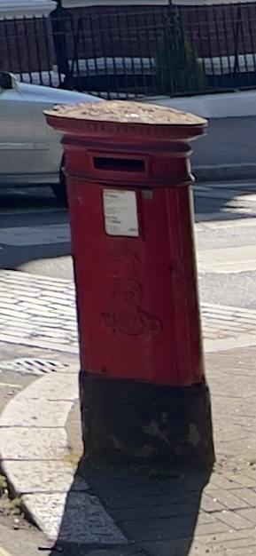

# THE LETTER BOX!

[](https://github.com/software-students-fall2023/5-final-project-samuel2-0/actions/workflows/ci.yaml/)

**Build Instructions:**

For our project, we created a letter app that allows you to find people of common interests and have letter-style correspondences with them. The goal was to create a format that slows communication when finding new friends - providing intentional and insightful contact. To run the app, please perform the following:


```
cd Desktop
```


```
git clone https://github.com/software-students-fall2023/5-final-project-samuel2-0.git
```

  
```
cd 5-final-project-samuel2-0
```


```
docker-compose up 
```

  
- Launch the container through the docker

  To utilize the app, create some mock accounts and navigate to the Find Pals tab. From there, you filter a user via their languages and interests. If you like someone, navigate to their profile and add them as a friend. From there, you can go to the compose tab and send them a letter. 

**Important Note About Deployment:** 
- We were able to publish our project to Docker Hub but had irreparable issues surrounding deployment. We could not resolve a building error from utilizing Macs with Arm-based processors. We spent an ungodly amount of time trying to fix the problem, but we could not resolve the issue. We appreciate your understanding. 

**Docker hub image:**
- The following is dependent on a mongo image being run alongside it, thanks. 
```
samuelshally/5-final-project-samuel2-0-web
```



